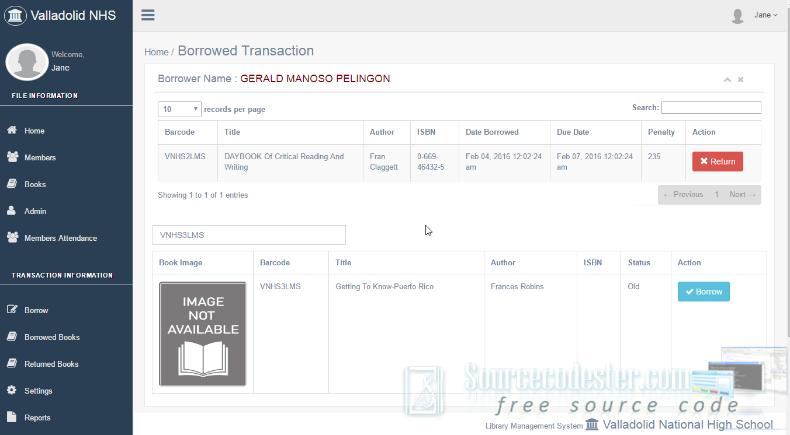

# Library Management System with Barcode using PHP

### Description

<em>This system is simple yet a useful system that I create using PHP/MySQL that uses barcodes for the borrowing books. This system I created may help you with your future projects. Also, for the beginners who really want to learn basic coding in PHP/MySQL. It is a user-friendly kind of this system.</em>

### Features

<ul>
  <li><strong>Member’s record management</strong></li>
  <li><strong>Books record management</strong></li>
  <li><strong>Admin record management</strong></li>
  <li><strong>Filtering book record</strong></li>
  <li><strong>Searching of the book in the table</strong></li>
  <li><strong>Borrowing and Returning books function</strong></li>
  <li><strong>Dynamic settings (Number of allowed books to borrow, Penalty, and Allowable days)</strong></li>
  <li><strong>Print Members Barcode</strong></li>
  <li><strong>Print List of Members</strong></li>
  <li><strong>Print Books Barcode</strong></li>
  <li><strong>Print List of Books</strong></li>
  <li><strong>Borrowed Books Monitoring</strong></li>
  <li><strong>Returned Books Monitoring</strong></li>
  <li><strong>Penalty Information</strong></li>
  <li><strong>Search report using date from and date to</strong></li>
  <li><strong>Generate Reports</strong></li>
</ul>

Visit [sourcecodester.com](https://www.sourcecodester.com/tutorials/php/10851/library-management-system-barcode.html) for more information about this project.

### Website Info

| Title | Library Management System with Barcode using PHP with Source Code |
|:---|:---|
| Website | [www.sourcecodester.com](https://www.sourcecodester.com) |
| Link | https://www.sourcecodester.com/tutorials/php/10851/library-management-system-barcode.html |
| Language | PHP |
| Developer/Uploader | [alpha_luna](https://www.sourcecodester.com/users/rolynjasper) |
